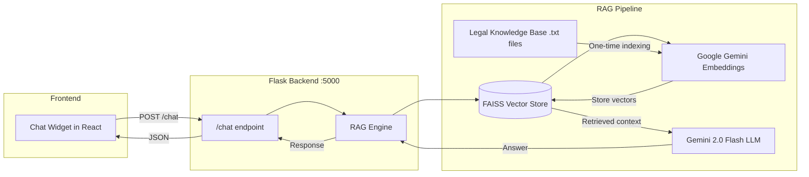

# 🤖 RAG Legal Assistant Chatbot — Implementation Plan

## 🎯 Goal
Build a domain-specific legal chatbot that helps MSMEs understand their rights under the MSMED Act 2006 using RAG (Retrieval-Augmented Generation).

---

## 🏗️ Architecture



---

## 📦 Tech Stack

| Component | Technology | Why |
|-----------|-----------|-----|
| **LLM** | Google Gemini 2.0 Flash | Free API, fast, excellent for legal text |
| **Embeddings** | Google `models/embedding-001` | Free, pairs with Gemini |
| **Vector Store** | FAISS (Facebook AI) | Local, fast, no server needed |
| **RAG Framework** | LangChain | Industry standard, handles chunking + retrieval |
| **Knowledge Base** | Text files | MSMED Act, RBI guidelines, Samadhaan process |
| **Backend** | Existing Flask app | New `/chat` route |
| **Frontend** | React chat widget | Embedded in existing sidebar |

---

## 📋 Implementation Steps

### Step 1: Knowledge Base (Legal Documents)
- Create `backend/knowledge_base/` directory
- Write comprehensive legal text files:
  - `msmed_act_2006.txt` — Full act coverage (Sections 15, 16, 17, 18)
  - `rbi_guidelines.txt` — Bank rate, interest rules
  - `msme_samadhaan.txt` — Filing process, eligibility, steps
  - `faq_msme_payments.txt` — Common questions and answers
  - `legal_remedies.txt` — Court options, arbitration, mediation

### Step 2: RAG Engine (`backend/rag_engine.py`)
- Load & chunk documents with LangChain TextLoader
- Generate embeddings with Google Gemini
- Store in FAISS vector index
- Build RetrievalQA chain with Gemini LLM
- Expose `ask(question)` function

### Step 3: Backend API Route
- Add `POST /chat` endpoint to [app.py](file:///d:/DigitalVakeel/backend/app.py)
- Accept `{ "question": "..." }`
- Return `{ "answer": "...", "sources": [...] }`

### Step 4: Frontend Chat Widget
- Build floating chat bubble + expandable chat panel
- Message history with user/bot bubbles
- Typing indicator animation
- Suggested questions for first-time users
- Integrate into existing App.js sidebar

### Step 5: Vector Store Build Script
- `backend/build_vectorstore.py` — one-time script to index documents
- Saves FAISS index to disk for reuse

---

## 🔑 Requirements

### Python Packages (backend)
```
langchain
langchain-google-genai
langchain-community
faiss-cpu
google-generativeai
```

### API Key Needed
- **Google Gemini API Key** (free at https://aistudio.google.com/apikeys)

---

## 📁 New Files to Create

```
backend/
├── knowledge_base/           # Legal document texts
│   ├── msmed_act_2006.txt
│   ├── rbi_guidelines.txt
│   ├── msme_samadhaan.txt
│   ├── faq_msme_payments.txt
│   └── legal_remedies.txt
├── rag_engine.py             # RAG pipeline (LangChain + FAISS + Gemini)
├── build_vectorstore.py      # One-time indexing script
└── vectorstore/              # FAISS index files (auto-generated)

frontend/src/
└── App.js                    # Add ChatWidget component
```
